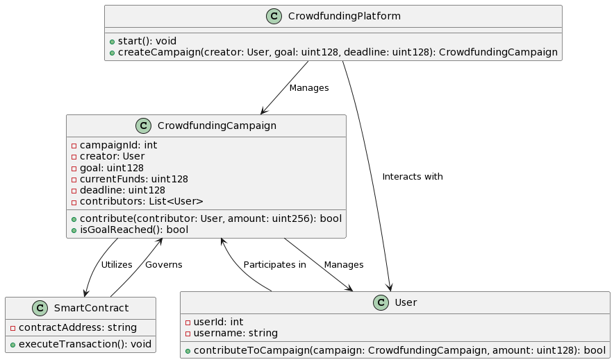

# Project-X
Decentralized Crowdfunding Platform
## Overview

Welcome to Project X, the next-generation decentralized crowdfunding platform powered by blockchain technology. Project X revolutionizes the way we fund and support innovative ideas, bringing transparency, security, and inclusivity to the crowdfunding landscape.

## Features

- **Decentralized Fundraising:** Leverage the power of blockchain to enable secure, transparent, and censorship-resistant fundraising.

- **Smart Contract Integration:** Utilize Ethereum smart contracts for automated and trustless execution of crowdfunding campaigns.

- **Tokenized Rewards:** Issue custom tokens to backers, unlocking unique privileges and rewards based on their contribution levels.

- **Global Accessibility:** Break down geographical barriers and empower creators and backers worldwide to participate in crowdfunding campaigns.

- **Immutable Records:** Every transaction and campaign detail is recorded on the blockchain, ensuring an immutable and auditable history.

- **Community Governance:** Token holders have a say in the platform's governance, creating a community-driven ecosystem.

## Getting Started

### Prerequisites

- Ensure you have a compatible Ethereum wallet (e.g., MetaMask) installed.
- Example: This is my wallet address on LightLink Testnet: 0xaA83DB0fCD5b96427050AFB086dB99057e5c99b4 
- Connect your wallet to the Project X platform.
- Acquire Ether (ETH) to participate in crowdfunding campaigns.

#### This UML is for general idea



### Installation

1. Clone the Project X repository:

   ```bash
   git clone https://github.com/vivekjami/Project-X.git

   *Note: the project is not complete this is the adstract model